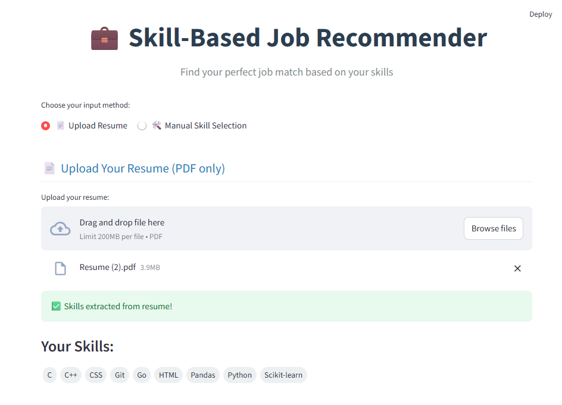
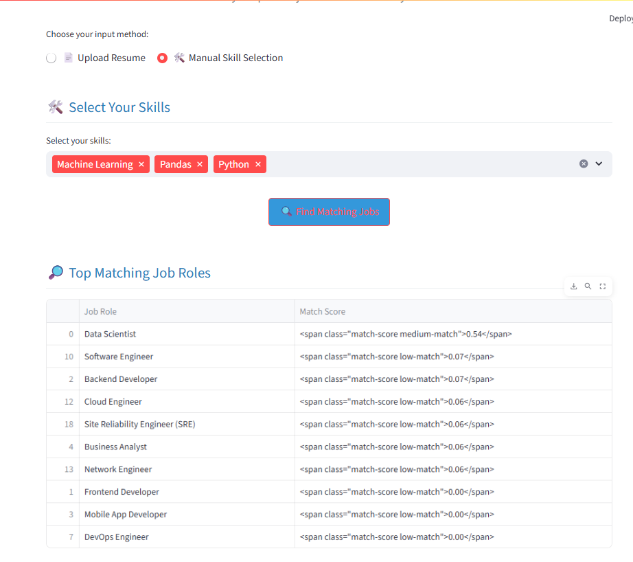

##  💼 SkillBridge-AI-Powered-Job-Recommender


A smart web application that analyzes your **skills** (from resume or manual input) and recommends **top matching job roles** using Natural Language Processing and Machine Learning.  
Perfect for freshers, students, and professionals looking to align their skillset with the right career paths.

---

## 🚀 Features

- 📄 Upload resume (PDF) OR manually select skills
- 🤖 Skill extraction + job role matching using TF-IDF + cosine similarity
- 📊 Match Score with color-coded badges
- 🧠 Skill Gap Analysis (matched vs missing skills)
- 📚 Learning suggestions for missing skills
- 🌗 Dark Mode ready (with customized styles)
- 📥 Download analysis as PDF (optional)
- 🔁 Suggests career paths based on skills

---

## 🧠 Tech Stack

- `Python`
- `Streamlit`
- `Pandas`, `Scikit-learn`
- `NLTK`, `PyMuPDF`
- `HTML/CSS` for custom UI
- `TF-IDF Vectorizer + Cosine Similarity` for recommendation

---

## 📸 Screenshots

| Resume Upload & Skill Extraction | Job Recommendations |
|----------------------------------|----------------------|
|      |  |

---

## 🛠️ How to Run Locally

1. **Clone the repo**
```bash
git clone https://github.com/Sunaina792/skill-job-recommender.git
cd skill-job-recommender
```
2. **Install dependencies**
```
pip install -r requirements.txt
```
3. **Run the app**
```
streamlit run app.py
```

---

📂 Dataset Used
Custom job roles dataset containing:

- Job Role

- Technical Skills

 - Soft Skills

Stored in a .pkl file: ```job_roles_dataset.pkl```

---

 ## 🙋‍♀️ Author
Made with 💖 by Sunaina

