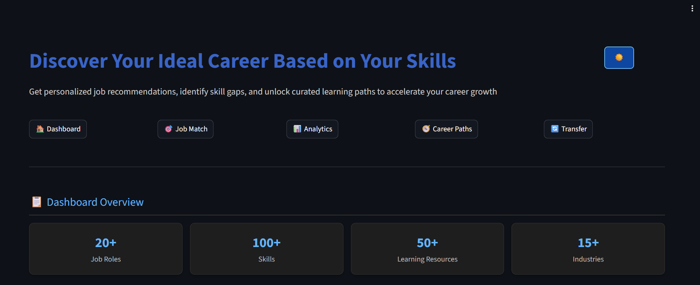
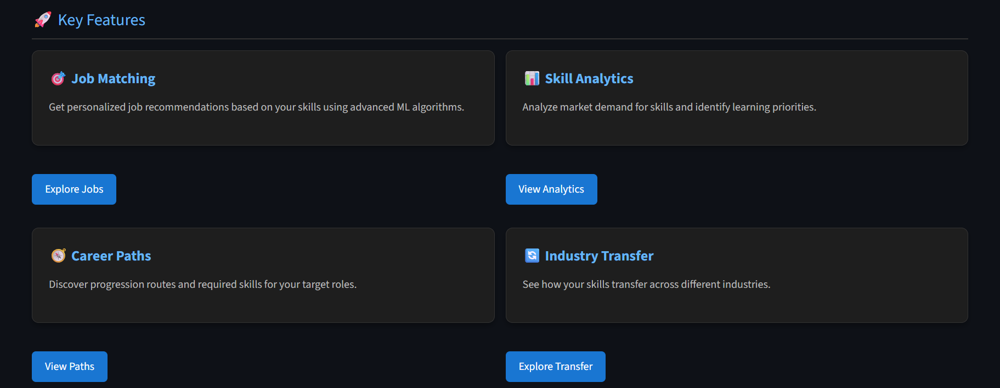

# Skill-Based Job Recommender System

A machine learning-powered application that recommends job roles based on user skills and provides comprehensive career development guidance.

## 🌟 Features

- **Job Role Recommendations**: Get personalized job matches based on your skills using TF-IDF and cosine similarity
- **Resume Parsing**: Automatically extract skills from PDF resumes
- **Skill Gap Analysis**: Identify missing skills for target job roles
- **Learning Resources**: Access curated courses and training materials
- **Market Demand Insights**: See which skills are trending in the job market
- **Career Path Visualization**: Explore progression opportunities
- **Cross-Industry Transfer**: Discover how your skills transfer to other industries

## 📸 Screenshots

| Dashboard | Features|
|----------------------------------|----------------------|
|      |  |

## 🚀 Getting Started

### Prerequisites

- Python 3.7 or higher
- pip package manager

### Installation

1. Clone the repository:
   ```bash
   git clone <repository-url>
   cd job-recommender
   ```

2. Install required packages:
   ```bash
   pip install -r requirements.txt
   ```

3. Run the application:
   ```bash
   streamlit run app.py
   ```

### Project Structure

```
job-recommender/
├── app.py                    # Main Streamlit application
├── Job_skill_recommender.ipynb # Jupyter notebook with model development
├── job_roles_with_skills_updated.csv # Job roles dataset
├── job_roles_dataset.pkl     # Pickled dataset for faster loading
├── learning_resources.csv    # Curated learning resources
├── trending_skills.csv       # Market demand data for skills
├── career_paths.csv          # Career progression routes
├── transferable_skills.csv   # Cross-industry skill mappings
├── requirements.txt          # Python dependencies
├── update_pickle.py          # Script to regenerate pickle files
└── check_pickle.py           # Script to validate pickle files
```

## 🎯 How It Works

1. **Data Processing**: The system uses a dataset of 20+ job roles with associated technical and soft skills
2. **Skill Matching**: TF-IDF vectorization converts skills to numerical representations
3. **Recommendation Engine**: Cosine similarity calculates matches between user skills and job requirements
4. **Enhanced Features**: Additional datasets provide learning resources, career paths, and industry transfer insights

## 📊 Datasets

### Job Roles Dataset
Contains job roles with technical and soft skill requirements

### Learning Resources
Curated courses and training materials from platforms like Coursera and LinkedIn Learning

### Trending Skills
Market demand scores for various skills to guide learning priorities

### Career Paths
Progression routes between job roles with required skills and time commitments

### Transferable Skills
Mappings of core skills across industries with similarity scores

## 🛠️ Technical Stack

- **Streamlit**: Web application framework
- **Pandas**: Data manipulation and analysis
- **Scikit-learn**: Machine learning algorithms (TF-IDF, cosine similarity)
- **NLTK**: Natural language processing
- **PyMuPDF**: PDF parsing for resume extraction

## 📚 Usage

1. **Input Skills**: Either upload a PDF resume or manually select skills
2. **View Recommendations**: See ranked job role matches with similarity scores
3. **Analyze Gaps**: Select a job role to see which skills you have and which you're missing
4. **Access Resources**: Get learning recommendations for missing skills
5. **Explore Paths**: Discover career progression opportunities and industry transfers

## 🤝 Contributing

1. Fork the repository
2. Create a feature branch
3. Commit your changes
4. Push to the branch
5. Create a Pull Request

## 📄 License

This project is licensed under the MIT License - see the LICENSE file for details.

## 🙏 Acknowledgments

- Thanks to all contributors who have helped build and improve this system
- Dataset sources and learning platform partners


